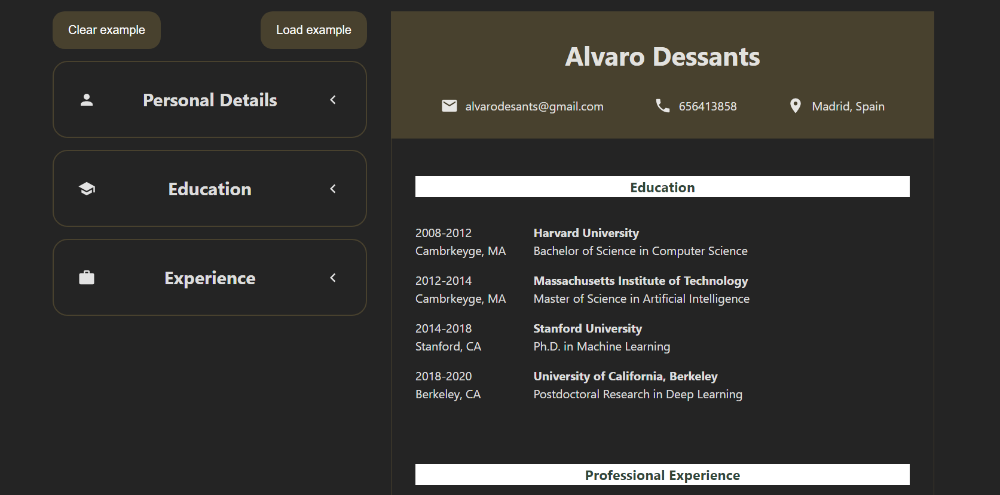

# CV-Application

## This project is my first project developed with React.js
It was created as part of [The Odin Project](https://www.theodinproject.com) course. 
In this project, I worked with useState for the first time and focused on organizing the React component structure.

The main goal of this project was to build a CV generator using React. The CV generator consists of two main sections: the control and the visualization sections. In the control section, the user can input, edit and delete their information. The information inputted in the control section will be available in real-time in the visualization section. 

## Live Demo
You can view the live version of the project [here](cv-applicaton.vercel.app).

## Skills Practiced
- React(including state management with useState, component structure)
- CSS

## Screenshot
